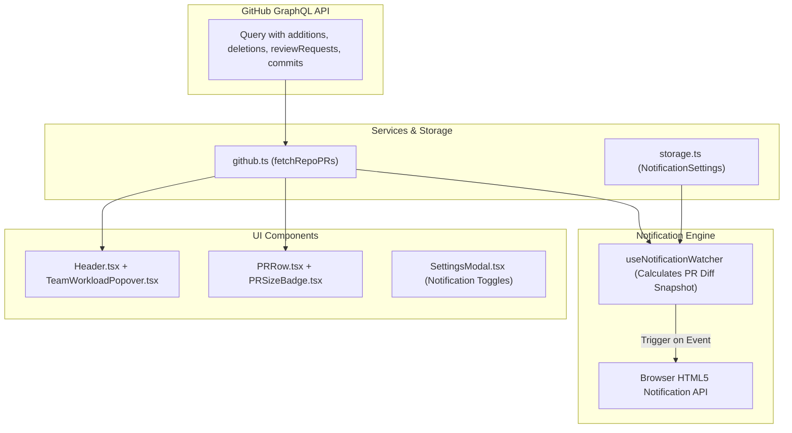

# Design Specification: Reviewer Productivity & Smart Notifications

**Date:** 2026-09-03  
**Status:** Approved  
**Target:** Client-side GitHub Pages SPA (React 19 + Vite + Tailwind CSS + Vitest)

---

## 1. Overview & Objectives

This specification enhances the GitHub PR Dashboard with two core feature sets:
1. **Reviewer Productivity & Velocity**:
   - **PR Size Badges (`XS`, `S`, `M`, `L`, `XL`)**: Visual categorization of PR complexity based on additions and deletions (`+add / -del`), allowing engineers to prioritize fast reviews.
   - **Team Reviewer Workload Widget**: An interactive header widget displaying pending review counts across teammates, with 1-click filtering to inspect any teammate's review queue.
2. **Smart Desktop Notifications**:
   - Native HTML5 browser notifications triggered on background auto-refresh polling for:
     - New review requests assigned to the current user.
     - CI check suite failures on PRs authored by the current user.
     - New comments on PRs authored by the current user.
     - PRs becoming stale (>48h without activity).
   - Granular notification preferences and permission management in Settings.

---

## 2. Architecture & Data Flow



---

## 3. Detailed Component & Service Design

### 3.1 Type Definitions (`src/types/index.ts`)
```typescript
export type PRSizeCategory = 'XS' | 'S' | 'M' | 'L' | 'XL';

export interface PullRequestItem {
  // ... existing fields
  additions: number;
  deletions: number;
  sizeCategory: PRSizeCategory;
}

export interface ReviewerWorkload {
  login: string;
  avatarUrl: string;
  pendingReviewsCount: number;
}

export interface NotificationSettings {
  enabled: boolean;
  notifyReviewRequests: boolean;
  notifyCIFailures: boolean;
  notifyComments: boolean;
  notifyStalePRs: boolean;
}

export interface AppSettings {
  // ... existing fields
  notifications: NotificationSettings;
}
```

### 3.2 GraphQL Query & Service Extension (`src/services/github.ts`)
* Extend `buildBatchedGraphQLQuery` to request `additions` and `deletions` on `pullRequests.nodes`.
* In `transformGraphQLPR`:
  ```typescript
  const additions = node.additions || 0;
  const deletions = node.deletions || 0;
  const totalChanged = additions + deletions;

  let sizeCategory: PRSizeCategory = 'XS';
  if (totalChanged >= 1000) sizeCategory = 'XL';
  else if (totalChanged >= 400) sizeCategory = 'L';
  else if (totalChanged >= 100) sizeCategory = 'M';
  else if (totalChanged >= 20) sizeCategory = 'S';
  ```

### 3.3 PR Size Badge Component (`src/components/PRSizeBadge.tsx`)
* Compact inline badge rendered next to the branch tag in `PRRow.tsx`:
  - **XS** (<20 lines): `bg-emerald-950/80 text-emerald-300 border-emerald-800/80`
  - **S** (<100 lines): `bg-emerald-950/80 text-emerald-300 border-emerald-800/80`
  - **M** (<400 lines): `bg-sky-950/80 text-sky-300 border-sky-800/80`
  - **L** (<1000 lines): `bg-amber-950/80 text-amber-300 border-amber-800/80`
  - **XL** (1000+ lines): `bg-rose-950/80 text-rose-300 border-rose-800/80`
* Accessible tooltip on hover: `Size: S (+45 / -12 lines across files)`.

### 3.4 Team Reviewer Workload Popover (`src/components/TeamWorkloadPopover.tsx`)
* Computes workload aggregating `reviewRequests` across all open PRs in memory.
* Trigger button in `Header.tsx`: `👥 Team Workload (N pending)`
* Popover displays:
  - Teammate avatar and username.
  - Number of pending reviews assigned.
  - Clicking a teammate filters the dashboard for PRs waiting on that reviewer.
  - "Clear Filter" button when a specific reviewer filter is active.

### 3.5 Notification Engine (`src/utils/notifications.ts` & `src/hooks/useNotificationWatcher.ts`)
* Uses native browser `Notification.requestPermission()` and `new Notification(title, { body, icon })`.
* Maintains snapshot of previous PR states (`id`, `ciStatus`, `lastInteraction.createdAt`, `isWaitingOnMe`, `slaStatus`).
* When `loadData()` completes:
  - If previous snapshot exists:
    1. **Review Request**: `isWaitingOnMe` transitioned from `false` to `true`.
    2. **CI Failure**: `isAuthoredByMe` is true and `ciStatus` transitioned to `FAILURE`.
    3. **New Comment**: `isAuthoredByMe` is true and `lastInteraction` is a comment with timestamp newer than previous snapshot.
    4. **Stale Alert**: `slaStatus` transitioned to `'stale'` on an open PR.
  - Dispatches browser notification with clickable action linking directly to `pr.url`.

### 3.6 Settings Modal Enhancements (`src/components/SettingsModal.tsx`)
* New section: **Desktop Notifications**
  - Main switch: Enable Browser Notifications (with permission request prompt).
  - 4 checkboxes for granular triggers:
    - [x] Review requests on me
    - [x] CI build failures on my PRs
    - [x] Comments on my PRs
    - [x] Stale PR warnings (>48h)

---

## 4. Testing & Verification Strategy

1. **Unit Tests**:
   - `PRSizeBadge.test.tsx`: Verify category mapping (`XS`, `S`, `M`, `L`, `XL`) and color styling.
   - `TeamWorkloadPopover.test.tsx`: Verify aggregation of reviewer counts, popover toggle, and click filtering.
   - `notifications.test.ts`: Verify diff detection logic for review requests, CI changes, comments, and staleness transitions.
   - `github.test.ts`: Verify `additions`, `deletions`, and `sizeCategory` extraction from GraphQL payloads.
2. **Integration Tests (`src/App.test.tsx`)**:
   - Verify Team Workload filtering updates PR table rows.
   - Verify notifications fire correctly on auto-refresh polling intervals.
3. **Build Verification**:
   - `npm test` passing with 100% success rate.
   - `npm run build` static compilation passing.
